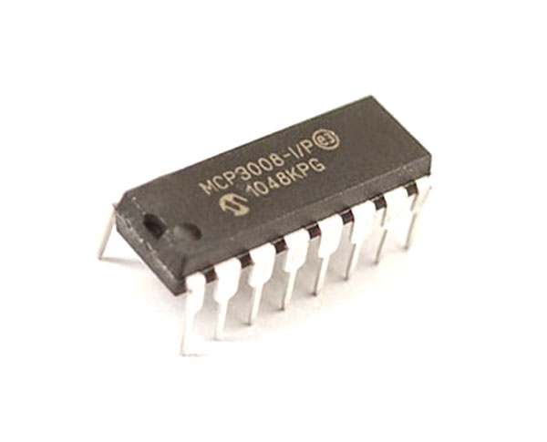
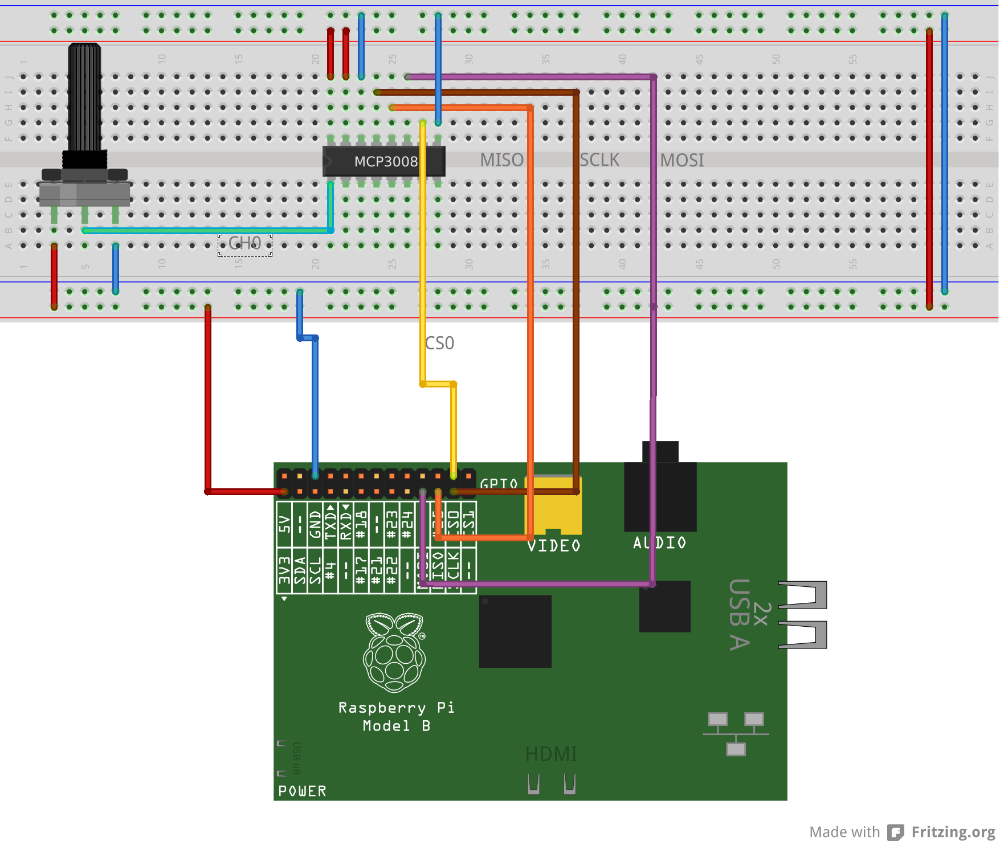

### Overview
You're going to implement the key functions for the mcp3008 analog-to-digital
converter (ADC).  It's cheap and has 8 inputs.  Pretty common.

<table><tr><td>
  
</td></tr></table>

<table><tr><td>
  
</td></tr></table>

So far this quarter we've interacted with digital devices that give a 0 or
a 1 as output, possibly with a time delay (e.g., sonar).  Many devices
(especially the cheaper, simpler ones) give out voltages instead.
Often getting a analog device working is easier than dealing with
configuring a digital device.

The downside of the R/PI is that it has no way to read these directly.
Instead we have to use an [ADC](https://en.wikipedia.org/wiki/Analog-to-digital_converter)
to convert the voltage to a number.

The MCP3008 code uses the SPI protocol to communicate by sending a
3-byte message requesting a reading and receives a 3-byte message back.
(See [here](http://www.hertaville.com/interfacing-an-spi-adc-mcp3008-chip-to-the-raspberry-pi-using-c.html) for a clear writeup.)
I've included an working SPI implementation so all you'll have to do is to
wire up your board for SPI.  You'll notice a downside of SPI --- it uses
a bunch of wires.   
(I'll do a bonus lab
tomorrow on how to use I2C which has fewer wires, but often I2C devices
cost more.)   
Look at the photo carefully!  

The following schematic is from the linked writeup above:
<table><tr><td>
  
</td></tr></table>

In terms of code, you'll have to implement use the mcp3008 datasheet (in
`docs/MCP3008.pdf`) to implement two things:
  1. The encoding for each ADC channel in the `adc-mcp3008.h` header file.
  2. The `adc_mcp3008_wr_cmd` and `adc_mcp3008_rd_cmd` routines, in the 
     `adc-mcp3008.c` source file, which are used to encode the 3-byte messages
     the ADC expects.

Once you get these working, you should be able to hook your microphone
up, or any number of other devices.

### Additional reading.

This is far from a complete or even the best list but here's a few places to 
get started with:
  - [Nice writeup](http://blog.falafel.com/mcp3008-analog-to-digital-conversion/).
  - [datasheet](https://cdn-shop.adafruit.com/datasheets/MCP3008.pdf)
  - [Adafruit writeup](https://learn.adafruit.com/reading-a-analog-in-and-controlling-audio-volume-with-the-raspberry-pi).
